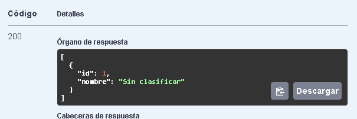
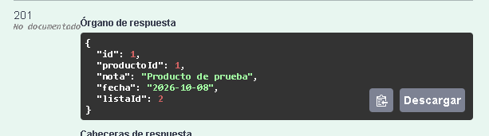

# TP2 - Persistencia, Migraciones y Arquitectura Hexagonal

API RESTful desarrollada con **Spring Boot 3.4.3** para la materia **Web II (UNVIME)**.

El proyecto continúa el desarrollo realizado en el TP1 e incorpora persistencia real mediante **PostgreSQL**, **Spring Data JPA** y **Flyway**, además de la gestión de listas de favoritos y una arquitectura basada en puertos y adaptadores.

---

## Tecnologías utilizadas

- Java 21
- Spring Boot 3.4.3
- Spring Web
- Spring Data JPA
- PostgreSQL 17
- Flyway
- Spring Validation
- Springdoc OpenAPI / Swagger UI
- Docker

---

## Cómo levantar el proyecto

### Requisitos previos

- Java 21 o superior
- Maven
- Docker Desktop

### 1. Clonar el repositorio

git clone https://github.com/garavagliaangelina81-creator/TP1-WEB2.git
cd TP1-WEB2
2. Levantar PostgreSQL con Docker

El proyecto incluye un archivo docker-compose.yml que configura PostgreSQL.

Ejecutar: docker compose up -d

Para verificar que el contenedor esté funcionando: docker ps

El contenedor utilizado por el proyecto es: webii-tp2

PostgreSQL queda disponible en: localhost:5432

Base de datos: webii_tp2

Usuario: webii_tp2

3. Ejecutar la aplicación

Desde la raíz del proyecto: mvn spring-boot:run

En el entorno utilizado para las pruebas, debido a la configuración de zona horaria de PostgreSQL, la aplicación se ejecutó con: 

.\mvnw.cmd spring-boot:run -Dspring-boot.run.jvmArguments="-Duser.timezone=UTC"

La aplicación queda disponible en: http://localhost:8080

Persistencia

La persistencia de favoritos y listas se realiza mediante PostgreSQL y Spring Data JPA.

Hibernate está configurado para validar el esquema existente en lugar de modificarlo automáticamente: spring.jpa.hibernate.ddl-auto=validate

También se deshabilitó Open Session in View: spring.jpa.open-in-view=false

De esta manera, la estructura de la base de datos queda controlada mediante las migraciones de Flyway.

Migraciones con Flyway

Las migraciones se encuentran en: src/main/resources/db/migration

El proyecto cuenta con cuatro migraciones:

V1 - Crear favoritos
V1__create_favoritos.sql

Crea la tabla favoritos con:

id
producto_id
nota
fecha_alta
V2 - Crear listas
V2__create_listas.sql

Crea la tabla listas con:

id
nombre
V3 - Relacionar favoritos con listas
V3__add_lista_id_to_favoritos.sql

Agrega la columna lista_id a favoritos y establece una clave foránea hacia listas.

V4 - Lista por defecto
V4__default_lista_sin_clasificar.sql

Esta migración:

Crea la lista Sin clasificar si todavía no existe.
Asigna a esa lista los favoritos que no tengan lista.
Establece lista_id como NOT NULL.

Las migraciones son versionadas y no se modifican una vez aplicadas.

Arquitectura

El proyecto utiliza una separación basada en puertos y adaptadores, manteniendo la lógica de negocio separada de la tecnología de persistencia.

Dominio
apiblanck.model

Contiene los modelos del dominio, entre ellos:

Favorito
Lista

Los modelos de dominio no dependen directamente de JPA.

Puertos

Los repositorios del dominio funcionan como puertos de salida:

FavoritoRepository
ListaRepository

Estos definen las operaciones necesarias para la lógica de negocio sin depender de una implementación concreta.

Adaptadores de persistencia

La implementación mediante PostgreSQL y JPA se encuentra en adaptadores específicos:

FavoritoRepositoryAdapter
ListaRepositoryAdapter

Estos utilizan:

FavoritoJpaRepository
ListaJpaRepository

que extienden JpaRepository.

De esta manera, la lógica de negocio depende de las interfaces de repositorio y no directamente de PostgreSQL o Hibernate.

Entidades JPA

Las entidades utilizadas para la persistencia son:

FavoritoEntity
ListaEntity

Estas clases están separadas de los modelos de dominio.

La relación entre favoritos y listas se representa mediante:

@ManyToOne

desde FavoritoEntity hacia ListaEntity.

No se utiliza una relación bidireccional @OneToMany.

Listas de favoritos

Se incorporó el concepto de listas para organizar los favoritos.

Cada favorito pertenece a una lista mediante listaId.

La base de datos utiliza una clave foránea: favoritos.lista_id -> listas.id

Existe una lista por defecto denominada: Sin clasificar

Endpoints
Productos
| Método | Path                  | Descripción                                     |
| ------ | --------------------- | ----------------------------------------------- |
| GET    | `/api/productos`      | Obtiene el listado de productos desde DummyJSON |
| GET    | `/api/productos/{id}` | Busca un producto específico por ID             |

Favoritos
| Método | Path                  | Descripción                 |
| ------ | --------------------- | --------------------------- |
| GET    | `/api/favoritos`      | Obtiene todos los favoritos |
| GET    | `/api/favoritos/{id}` | Obtiene un favorito por ID  |
| POST   | `/api/favoritos`      | Crea un favorito            |
| PUT    | `/api/favoritos/{id}` | Actualiza un favorito       |
| DELETE | `/api/favoritos/{id}` | Elimina un favorito         |

Listas
| Método | Path                                     | Descripción                             |
| ------ | ---------------------------------------- | --------------------------------------- |
| GET    | `/api/listas`                            | Obtiene todas las listas                |
| GET    | `/api/listas/{id}`                       | Obtiene una lista por ID                |
| POST   | `/api/listas`                            | Crea una nueva lista                    |
| GET    | `/api/listas/{id}/favoritos`             | Obtiene los favoritos de una lista      |
| DELETE | `/api/listas/{id}`                       | Elimina una lista vacía                 |
| POST   | `/api/listas/{origenId}/mover-favoritos` | Mueve los favoritos de una lista a otra |

Reglas de negocio
Eliminación de una lista

Una lista que contiene favoritos no puede eliminarse.

En ese caso la API responde:

409 Conflict

Si la lista está vacía, puede eliminarse correctamente.

Consulta de una lista inexistente
Si se solicita una lista que no existe, la API responde: 404 Not  Found

Mover favoritos entre listas

El endpoint: POST /api/listas/{origenId}/mover-favoritos

permite mover todos los favoritos de una lista de origen hacia una lista de destino.

La operación se encuentra dentro de un método transaccional: @Transactional

Esto permite que la operación se ejecute de manera atómica: el movimiento de los favoritos y la eliminación de la lista de origen forman parte de la misma transacción.

Si ocurre un error durante la operación, los cambios pueden revertirse evitando dejar la base de datos en un estado intermedio.

Validaciones y manejo de errores

La API utiliza Bean Validation para validar los datos de entrada.

Por ejemplo:

@NotNull
@NotBlank
@Size

Los errores son manejados mediante un controlador global de excepciones.

Se contemplan, entre otros:

404 Not Found para recursos inexistentes.
409 Conflict para conflictos de reglas de negocio.
400 Bad Request para errores de validación.

Swagger / OpenAPI

La API cuenta con documentación OpenAPI y Swagger UI.

Con la aplicación ejecutándose, se puede acceder desde:

http://localhost:8080/swagger-ui.html

Swagger permite consultar y probar los endpoints directamente desde el navegador.

Los endpoints cuentan con documentación mediante anotaciones @Operation.

Dependencias principales
spring-boot-starter-web — desarrollo de la API REST.
spring-boot-starter-validation — validación de datos.
spring-boot-starter-data-jpa — persistencia mediante JPA.
postgresql — conexión con PostgreSQL.
flyway-core — gestión de migraciones.
flyway-database-postgresql — soporte de Flyway para PostgreSQL.
springdoc-openapi-starter-webmvc-ui — documentación OpenAPI y Swagger UI.

Evidencias

### 1. Listado de listas

Se verifica el correcto funcionamiento del endpoint `GET /api/listas`, obteniendo como respuesta HTTP `200 OK` y la lista por defecto **"Sin clasificar"**.

### 2. Creación de una lista

Se verifica el correcto funcionamiento del endpoint `POST /api/listas`, creando correctamente la lista **"Trabajo"** y obteniendo una respuesta HTTP `200 OK`.

[Creación de lista](docs/lista-creacion.png)

### 3. Creación de un favorito

Se verifica el correcto funcionamiento del endpoint `POST /api/favoritos`, creando un favorito asociado al producto `1` y a la lista `2`, con respuesta HTTP `201 Created`.

